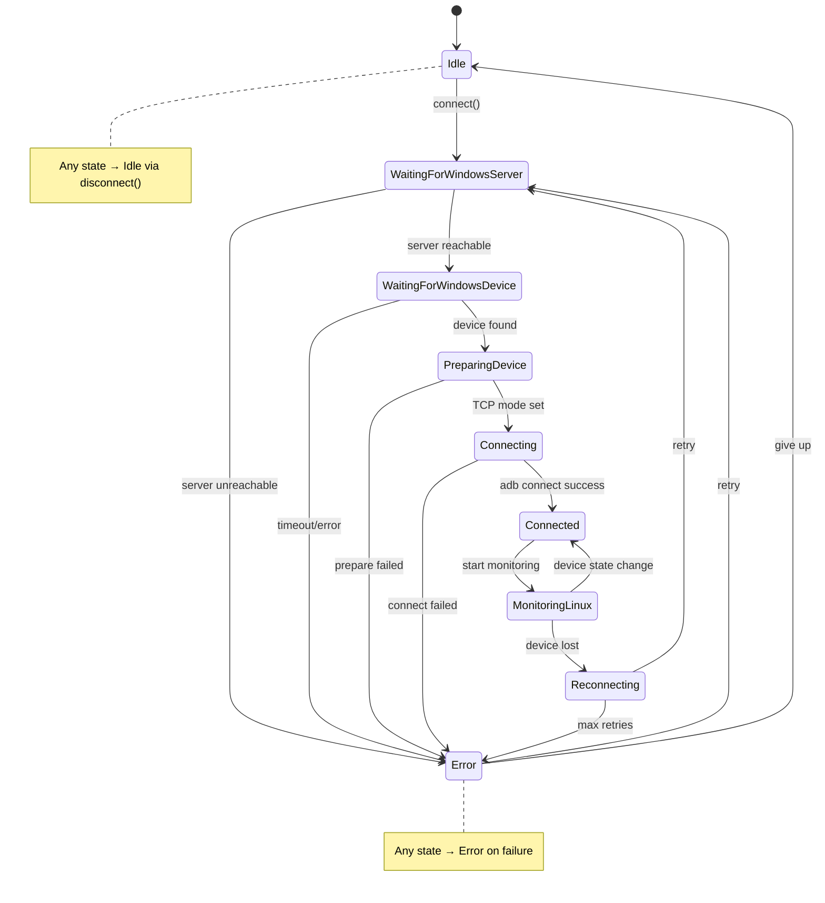

# Architecture

This document describes the technical architecture of the Remote ADB Connector plugin.

## Overview

The plugin automates the workflow of connecting a USB-connected Android device on a Windows machine to a Linux machine running Android Studio over LAN. It replaces multiple shell scripts with a native Kotlin implementation built on the IntelliJ Platform SDK.

## Component Diagram

```
┌──────────────────────────────────────────────────────────────┐
│                     RemoteAdbService                          │
│                   (Top-level orchestrator)                     │
├──────────────┬─────────────────────────┬─────────────────────┤
│              │                         │                      │
│   ConnectionManager            StateMachine                   │
│   (Workflow engine)          (State management)               │
│              │                         │                      │
├──────────────┼─────────────────────────┼─────────────────────┤
│              │                         │                      │
│   WindowsAdbMonitor          LinuxAdbMonitor                  │
│   (Remote polling)          (Local polling)                   │
│              │                         │                      │
├──────────────┴─────────────────────────┴─────────────────────┤
│                                                               │
│                         AdbExecutor                           │
│                   (Process execution layer)                    │
│                                                               │
├───────────────────────────────────────────────────────────────┤
│                                                               │
│    DeviceParser    │    PluginSettings    │  NotificationSvc   │
│                                                               │
└───────────────────────────────────────────────────────────────┘
```

## State Machine

The plugin is built around an explicit finite state machine that drives all behavior:



## Data Flow

### Connection Workflow

```
1. User clicks Connect
   └── RemoteAdbService.connect()
       └── Validates settings
       └── Launches coroutine
           └── ConnectionManager.connect()

2. Verify Windows Server
   └── AdbExecutor.executeOnWindows("devices")
       └── ProcessBuilder with ADB_SERVER_SOCKET=tcp:<windows-ip>:5037

3. Find Devices
   └── AdbExecutor.executeOnWindows("devices", "-l")
       └── DeviceParser.parseLong(output)

4. Prepare Device
   └── AdbExecutor.executeOnWindows("-s", serial, "tcpip", "5555")
   └── AdbExecutor.executeOnWindows("-s", serial, "shell", "ip", "route")
       └── DeviceParser.parseDeviceIp(output)

5. Connect Locally
   └── AdbExecutor.executeOnLocal("connect", "192.168.1.105:5555")
       └── ProcessBuilder with ADB_SERVER_SOCKET=tcp:127.0.0.1:5037
   └── AdbExecutor.executeOnLocal("devices")
       └── DeviceParser.parse(output) → verify device present

6. Monitor
   └── LinuxAdbMonitor.start()
       └── Periodic: AdbExecutor.executeOnLocal("devices")
       └── On loss: ConnectionManager.reconnect()
```

### ADB Server Switching

The plugin **never** modifies global environment variables. Instead, each `ProcessBuilder` invocation sets `ADB_SERVER_SOCKET` per-process:

```kotlin
// Talk to Windows ADB server
processBuilder.environment()["ADB_SERVER_SOCKET"] = "tcp:192.168.1.10:5037"

// Talk to local Linux ADB server
processBuilder.environment()["ADB_SERVER_SOCKET"] = "tcp:127.0.0.1:5037"
```

This allows interleaved Windows and Linux ADB operations without side effects.

## Threading Model

| Thread | Usage |
|--------|-------|
| **EDT** | All UI updates (Swing components) |
| **IO Dispatcher** | ADB command execution, connection workflow |
| **WindowsAdbMonitor thread** | Daemon thread for Windows polling |
| **LinuxAdbMonitor thread** | Daemon thread for local polling |

**Rules:**
- Never block EDT
- All UI updates via `ApplicationManager.getApplication().invokeLater { }`
- All ADB commands on background threads
- StateFlow emissions from any thread; collection on Dispatchers.Default

## Component Details

### AdbExecutor

- **Scope**: Project-level service
- **Responsibility**: Execute ADB commands via ProcessBuilder
- **Key design**: Per-process `ADB_SERVER_SOCKET` environment variable
- **Features**: Timeout support, stdout/stderr capture, exit code validation

### StateMachine

- **Scope**: Project-level service
- **Responsibility**: Manage FSM state and validate transitions
- **Observability**: `StateFlow<ConnectionState>` for reactive UI updates
- **Safety**: Thread-safe, validated transitions, history tracking

### ConnectionManager

- **Scope**: Project-level service
- **Responsibility**: Orchestrate the 6-step connection workflow
- **Dependencies**: AdbExecutor, StateMachine, DeviceParser, PluginSettings
- **Key methods**: `connect()`, `disconnect()`, `reconnect()`, `prepareDevice()`

### WindowsAdbMonitor / LinuxAdbMonitor

- **Scope**: Project-level services, Disposable
- **Responsibility**: Periodic polling with change detection
- **Scheduling**: `ScheduledExecutorService` (daemon threads)
- **Communication**: Callbacks for device changes / losses

### DeviceParser

- **Scope**: Object (stateless)
- **Responsibility**: Parse `adb devices` output into Device objects
- **Methods**: `parse()`, `parseLong()`, `parseDeviceIp()`
- **Design**: Pure functions, no side effects, easily testable

### PluginSettings

- **Scope**: Application-level service
- **Persistence**: `SimplePersistentStateComponent` → `remote-adb-connector.xml`
- **State**: `BaseState` with delegated properties

### NotificationService

- **Scope**: Project-level service
- **Responsibility**: User notifications with throttling
- **Throttling**: 10-second deduplication window per notification key

## Error Handling Strategy

1. **ADB command failures**: Captured in `CommandResult`, logged, reported via notifications
2. **Network errors**: Caught in `AdbExecutor`, returned as `CommandResult.failure()`
3. **Timeouts**: `ProcessBuilder.waitFor()` with configurable timeout
4. **Invalid state transitions**: Logged and rejected (no-op)
5. **IDE shutdown**: `Disposable` lifecycle, `CoroutineScope` cancellation
6. **Configuration errors**: Validated before workflow starts

## Package Structure

```
com.adbconnect.plugin
├── model/          # Data classes: ConnectionState, Device, CommandResult
├── service/        # Core services: AdbExecutor, StateMachine, ConnectionManager, Monitors
├── settings/       # Persistent configuration
├── notification/   # IntelliJ notifications with throttling
├── ui/             # ToolWindow factory and panel
└── util/           # Utilities: IpValidator, AdbPathResolver
```
