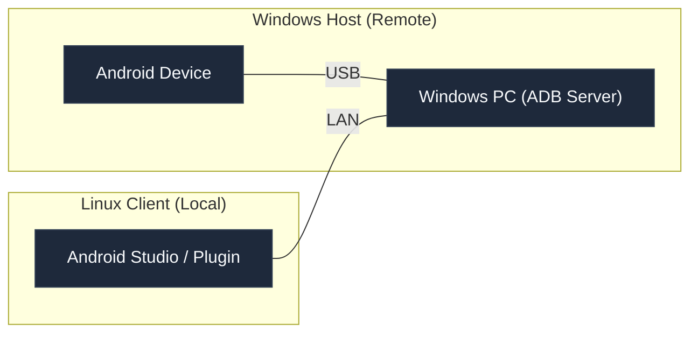
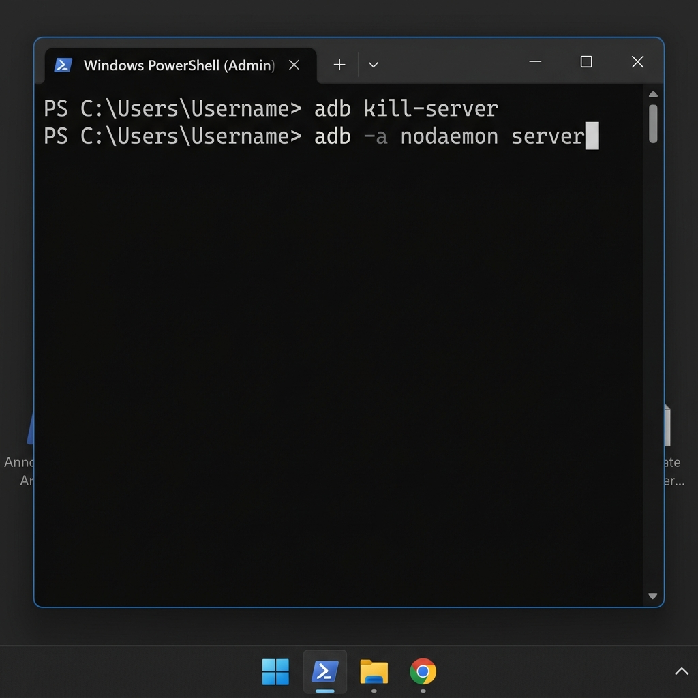
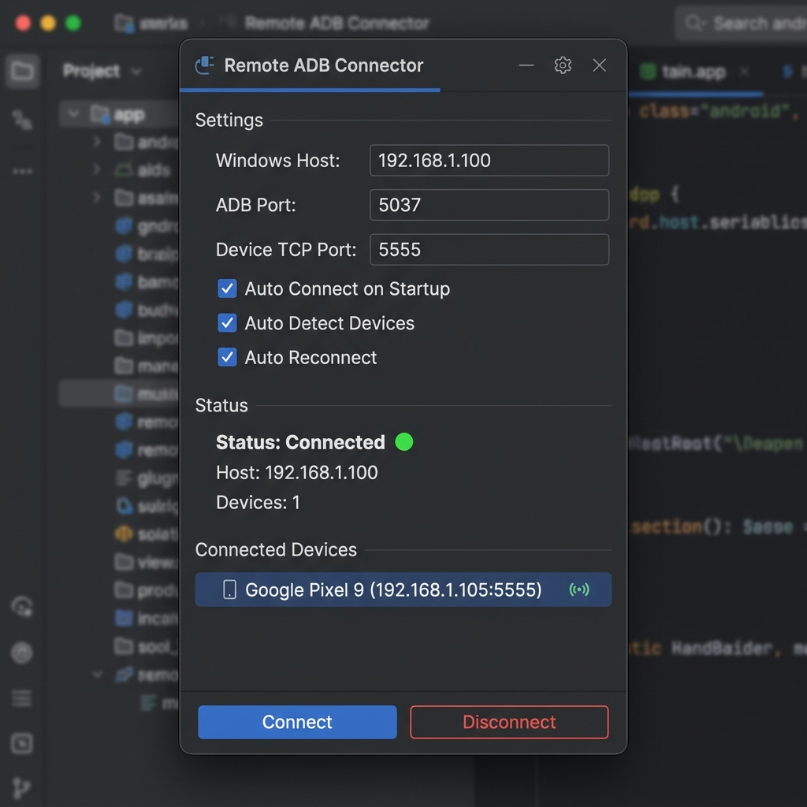

# Remote ADB Connector: Step-by-Step Usage Guide

This guide describes how to configure and use the **Remote ADB Connector** plugin to connect Android devices physically connected to your Windows laptop to your remote/local Linux Android Studio instance over the network.

---

## 📋 Architectural Overview

Before setting up, it helps to understand the connection topology:



By default, the Windows ADB server only accepts connections from the local machine (`127.0.0.1`). To allow the Linux client to discover and connect to the device, we must expose the Windows ADB server to the network.

---

## 🛠️ Step 1: Prepare the Windows Host (Windows Laptop)

### 1. Enable USB Debugging on Your Android Device
1. On your Android device, go to **Settings** -> **About Phone** and tap **Build Number** 7 times to enable Developer Options.
2. Go to **Settings** -> **System** -> **Developer Options** and enable **USB Debugging**.
3. Connect the phone to the Windows laptop via USB.

### 2. Run the ADB Server Exposing It to the Network
By default, the ADB server binds to `localhost:5037`. To bind it to all network interfaces so your Linux machine can connect to it, open **Command Prompt** or **PowerShell** on Windows and run:

```cmd
:: Kill any existing local ADB server running on Windows
adb kill-server

:: Start the ADB server listening on all network interfaces
adb -a nodaemon server
```

> [!IMPORTANT]
> The `-a` flag tells the ADB server to listen on all interfaces (e.g., `0.0.0.0`), allowing external network connections. Using `nodaemon` runs the server in the foreground, which shows connection logs in real-time. If you prefer to run it in the background, you can use `adb -a server`.



> [!WARNING]
> **Windows Firewall Prompt:** When you run `adb -a nodaemon server`, Windows Defender Firewall may prompt you to allow network access. Make sure to check **Private networks** (and Public networks if on a shared Wi-Fi) and click **Allow access**. If the prompt does not appear and connection fails, you may need to add an inbound rule for TCP port `5037`.

---

## 🔍 Step 2: Get the Windows Host IP Address

To connect the plugin to Windows, you need the IP address of your Windows laptop:
1. In PowerShell or Command Prompt, run:
   ```cmd
   ipconfig
   ```
2. Look for your active network adapter (e.g., **Wireless LAN adapter Wi-Fi** or **Ethernet adapter**).
3. Copy the **IPv4 Address** (e.g., `192.168.1.100`).

---

## 🧩 Step 3: Install the Plugin in Android Studio (Linux)

1. Open Android Studio on your Linux machine.
2. Open **Settings** (or **Preferences** on older versions) -> **Plugins**.
3. Select the **Marketplace** tab, search for `Remote ADB Connector`, and click **Install** (or install from ZIP).
4. Restart Android Studio if prompted.

---

## ⚙️ Step 4: Configure and Connect in Android Studio

1. Open your project in Android Studio.
2. Locate the **Remote ADB** tool window on the right-hand sidebar and click to open it.
3. Configure the settings:
   * **Windows Host:** Enter the Windows IPv4 address you copied in Step 2 (e.g., `192.168.1.100`).
   * **ADB Port:** Keep the default `5037` (the Windows ADB server port).
   * **Device TCP Port:** Keep the default `5555` (this is the port that the phone will use to listen for TCP connections).
   * **Polling Interval (s):** Keep `5` seconds (how frequently the plugin checks device status).
   * **Checkboxes:**
     * **Auto Connect on Startup:** Check this if you want the plugin to automatically connect whenever you open Android Studio.
     * **Auto Detect Devices:** Automatically detects USB-connected devices on the Windows machine.
     * **Auto Reconnect:** Automatically monitors the connection and reconnects if the connection drops.
4. Click **Connect**.



---

## 🎉 Step 5: How It Works Behind the Scenes

Once you click **Connect**, the plugin performs the following steps automatically:
1. **Verifies Remote Server:** Connects to the remote Windows ADB server on port `5037`.
2. **Discovers USB Devices:** Queries the Windows server for connected USB devices.
3. **Switches Device to TCP Mode:** Automatically runs `adb -s <device_serial> tcpip 5555` on the remote device.
4. **Retrieves Device Network IP:** Automatically queries the device's IP address on the Wi-Fi/local network.
5. **Establishes Local Connection:** Runs `adb connect <device_ip>:5555` on your Linux machine, establishing a direct connection.
6. **Device Appears in Android Studio:** The device is now listed in Android Studio’s target device dropdown, ready for running or debugging apps.

---

## 🛠️ Troubleshooting

### ❌ Error: "Cannot reach ADB server"
* Check if `adb -a nodaemon server` is currently running on your Windows machine.
* Verify both machines are on the same Wi-Fi or local network.
* Ping your Windows IP from Linux: `ping <windows-ip>` to verify basic network connection.
* Add an inbound firewall rule on Windows for TCP port `5037`.

### ❌ Error: "No devices found"
* Ensure your phone is connected to your Windows machine via a USB cable.
* Verify that running `adb devices` directly on Windows lists your device. If it shows `unauthorized`, look at your phone screen and grant USB debugging permissions.
* Check if the device is connected to the same Wi-Fi network as the laptop. (Wi-Fi is required to establish the network TCP/IP bridge).
